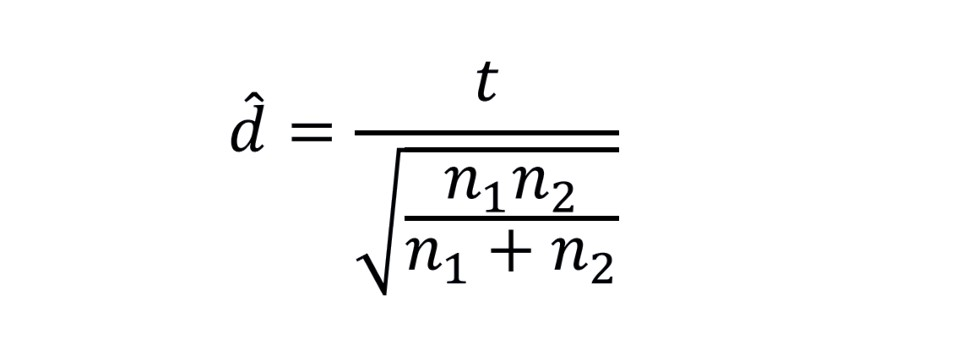

```{r setup, include=FALSE}
knitr::opts_chunk$set(echo = TRUE)
```

\newpage

## Learning Objectives
1. Run a two-sample t-test
2. Review of necessary functions


## Coding Examples

### Load Packages and Data

Before we get started, be sure to load the following packages. 

```{r load_packages, message = FALSE, warning = FALSE}
library(ggplot2)
```

We will also take this time to read in our data set. We will be using the `dds` data set from Lab 4.

```{r read_data}
load("dds.rda")
```

As a reminder...

In the U.S., individuals with developmental disabilities receive services and support from state governments. The State of California allocates funds to developmentally-disabled residents through the California Department of Developmental Services (or DDS). Individuals receiving DDS funds are referred to as "consumers" by the department. 

One of the responsibilities of DDS is to allocate funds that support over 250,000 developmentally-disabled residents. *A team of researchers examined the allocation of funds by ethnicity and found that the mean expenditures for Hispanic consumers was approximately one-third of the mean expenditures of White non-Hispanic consumers.* This striking discrepancy prompted allegations of race-based discrimination against the California DDS. These allegations resulted in a formal suit being filed against the state of California, claiming that its DDS program was guilty of race-based discrimination.

The data set `dds` represents a sample of 630 DDS consumers, and includes information about age, sex, ethnicity, and the amount of financial support per consumer provided by DDS. 

1. `expenditures`: amount of services and support provided by DDS (in dollars)
2. `age`: age of consumer (in years)
3. `age.group`: age group of consumer ("Child" or "Adult")
4. `sex`: sex of consumer ("Female" or "Male")
5. `ethnicity`: ethnicity of consumer ("Hispanic" or "White non-Hispanic")

If you'd like a preview of the data, run the code chunk below. 

```{r preview_data}
head(dds)
```


### Review of Lab 4 Analysis

With the `dds` data, we observed an association between expenditures and ethnicity.

```{r analysis_review_1}
ggplot(data = dds, aes(x = ethnicity, y = expenditures)) + 
  
  geom_boxplot() + 
  
  labs(title = "Boxplots of Expenditures by Ethnicity",
       x = "Ethnicty",
       y = "Expenditures (in $)")
```

```{r analysis_review_2}
aggregate(expenditures ~ ethnicity, data = dds, FUN = mean)
```

If we wanted to test whether the average expenditures differed by ethnicity using a formal inference procedure, we could run a two-sample t-test.


### Two-Sample t-Tests

To assess if there is a difference in the average expenditures of Hispanic consumers and the average expenditures of white non-Hispanic consumers, the hypotheses would be:

- H0: mu_Hispanic - mu_White = 0
- Ha: mu_Hispanic - mu_White =/ 0

Where "mu_Hispanic- mu_White" would represent the true, but unknown difference in the mean expenditures of Hispanic consumers and the mean expenditures of white non-Hispanic consumers.

When running a two-sample t-test in R, there are two things to note. 

1. The *order of the variables matters* (the quantitative response variable must go first)
2. The two variables are separated by a tilde (~)  

For the `alternative` argument, we need to specify the direction of the alternative hypothesis. The three options that we can provide are:

- "less"
- "greater"
- "two.sided"

Please note that we must include quotation marks around the text. 

To evaluate if there is a difference in the average expenditures of Hispanic and white non-Hispanic consumers, the code would look like this:

```{r two_sample_t_test_example}
t.test(expenditures ~ ethnicity, data = dds, alternative = "two.sided")
```

The p-value of "< 2.2e-16" may seem strange...

This is scientific notation for a value that is less than 2.2 x 10^(-16) (or 0.00000000000000022). In other words, the test returns an *extremely* small p-value. 

The data provide *very strong* evidence to suggest that there is a *difference* in the average expenditures of Hispanic and white non-Hispanic consumers. (And this result makes sense based on what we observed in the side-by-side boxplots.)


When the `alternative` argument is set to "two.sided", the output also provides us with a confidence interval. By default, the output provides a *95%* confidence interval. 

From the example above...we estimate, with 95% confidence, that the true, but unknown difference in mean expenditures amounts (Hispanic consumers - white non-Hispanic consumers) is between -19,414.66 dollars and -13,324.38 dollars. This suggests that white non-Hispanic consumers receive roughly 13 to 19 thousand dollars more than Hispanic consumers, on average.


### Confounding Variables

Confounding factors are variables that are associated with *both* the explanatory variable *and* the response variable. Confounding variables get in the way of being able to make causal conclusions about the relationship between explanatory and response variables. 

In the Lab 4 Resources document, we observed that age group displayed an association with expenditures *and* that age group displayed an association with ethnicity. 

To visualize the effect of a confounding variable, we can incorporate a third variable into our side-by-side boxplots using color.

```{r analysis_review_3}
ggplot(data = dds, aes(x = age.group, y = expenditures, fill = ethnicity)) + 
  
  geom_boxplot() + 
  
  labs(title = "Boxplots of Expenditures by Age Group and Ethnicity",
       x = "Age Group",
       y = "Expenditures (in $)",
       fill = "Ethnicity")
```

Once we factor age group into the analysis, there no longer appears to be a difference in the average expenditures of Hispanic and white non-Hispanic consumers (for both children and adults, respectively).


To compare the average expenditures using formal inference, we can subset (i.e., filter) the data to children and adults -- and then test for a difference in the average expenditure amounts between Hispanic and white non-Hispanic consumers for each subset. 

Note: you do not need to know how to subset data - this code will be provided to you.

```{r child_subset}
children <- subset(dds, age.group == "Child")
```

The code chunk above created a new data set called `children`, which you should now see in your Global Environment (in the upper right window). This data set has been filtered to contain only consumers that are labeled as children. 

Using the set of children, we can run a two-sample t-test to determine if a difference exists in the average expenditures of Hispanic and white non-Hispanic consumers.

```{r two_sample_t_test_example_2}
t.test(expenditures ~ ethnicity, data = children, alternative = "two.sided")
```

With a p-value of 0.8472, there is not enough evidence against the null and in support of the alternative. Based on the sample data, we do not have enough evidence to suggest that, *for children*, there is a difference between the average expenditures of Hispanic consumers and the average expenditures of white non-Hispanic consumers.


We could then repeat this process for the adult consumers. 

```{r adult_subset}
adult <- subset(dds, age.group == "Adult")
```

```{r two_sample_t_test_example_3}
t.test(expenditures ~ ethnicity, data = adult, alternative = "two.sided")
```

With a p-value of 0.5701, there is not enough evidence against the null and in support of the alternative. Based on the sample data, we do not have enough evidence to suggest that, *for adults*, there is a difference between the average expenditures of Hispanic consumers and the average expenditures of white non-Hispanic consumers.

Additionally, both confidence intervals (for children and adults) contain 0 - suggesting there is no difference in the average expenditure amounts between Hispanic and white non-Hispanic consumers.

These conclusions agree with what we observed in the three-way plot.


### Estimated Effect Size

If we wish to compute an estimated effect size for a two-sample t-test, the following formula is used:



Suppose we wanted to compute the estimated effect size for the two-sample t-test comparing the average expenditures of Hispanic adults and white non-Hispanic adults (the very last t-test run above). We know the value of t (0.5699, from above), but we would need to find the number of Hispanic adults (n1) and the number of white non-Hispanic adults (n2). This can be done using the `table()` function.

```{r table_example}
table(adult$ethnicity)
```

The estimated effect size can then be computed in R (or using a calculator).

```{r estimated_effect_size}
0.5699 / sqrt((60*199)/(60+199))
```

Refer to your lecture notes for how to interpret this value!


## Function Review

In order to complete the case study, you will need some functions from previous labs. Instead of navigating back and forth, we have included some coding examples below. 


### Boxplots

Visualize a quantitative response across the groups of a categorical variable.

```{r boxplot_example}
ggplot(data = dds, aes(x = age.group, y = expenditures)) + 
  
  geom_boxplot() +
  
  labs(title = "Boxplots of Expenditures by Age Group",
       x = "Age Group",
       y = "Expenditures (in $)")
```


### Numerical Summaries by Group

Compute numerical summaries across the groups of a categorical variable.

```{r aggregate_example}
aggregate(expenditures ~ age.group, data = dds, FUN = mean)
```

Reminder: if you choose to use `summary` or `quantile` for your `FUN`, the output of the `aggregate()` function will only appear in the knitted PDF. For example, if you run the code chunk below, no output will appear. However, if you knit this document, the summary values of expenditures by ethnicity will appear in the knitted PDF.

```{r aggregate_example_summary}
aggregate(expenditures ~ ethnicity, data = dds, FUN = summary)
```


### Stacked Bar Charts and Percent Stacked Bar Charts

Visualize the association between two categorical variables. Note: be careful with the y-axis labels of these two plots!

```{r stacked_bar_chart_example}
ggplot(data = dds, aes(x = ethnicity, fill = age.group)) + 
  
  geom_bar() +
  
  labs(title = "Stacked Bar Chart of Ethnicity by Age Group",
       x = "Ethnicity",
       y = "Frequency",
       fill = "Age Group")
```

```{r percent_stacked_bar_chart_example}
ggplot(data = dds, aes(x = ethnicity, fill = age.group)) + 
  
  geom_bar(position = "fill") +
  
  labs(title = "Percent Stacked Bar Chart of Ethnicity by Age Group",
       x = "Ethnicity",
       y = "Proportion",
       fill = "Age Group")
```


### Two-Way Frequency Tables

Count the number of observations that fall into the groups of two categorical variables - and compute helpful proportions from them.

```{r two_way_frequency_table_example}
addmargins(table(dds$age.group, dds$ethnicity))
```

```{r proportion_examples}
# Proportion of Hispanic consumers that are adults
60 / 298

# Proportion of white non-Hispanic consumers that are adults
199 / 332
```


### Three-Way Plots

Visualize the effects of a confounding variable by plotting three variables at once.

```{r three_way_plot_example}
ggplot(data = dds, aes(x = age.group, y = expenditures, fill = ethnicity)) + 
  
  geom_boxplot() + 
  
  labs(title = "Boxplots of Expenditures by Age Group and Ethnicity",
       x = "Age Group",
       y = "Expenditures (in $)",
       fill = "Ethnicity") 
```


### Numerical Summaries by Two Grouping Variables

Compute numerical summaries across the groups of two categorical variables.

```{r aggregate_example_two_categorical_variables}
aggregate(expenditures ~ ethnicity + age.group, data = dds, FUN = mean)
```

If you wish to customize the plots with your own colors, check out the examples below. Otherwise, click on the file titled `CaseStudy2_Report.Rmd` to navigate to the case study assignment!


If you wish to specify the colors used in your plots, check out the examples below! You simply need to add `scale_fill_manual()` to the end of your code. An extensive list of available colors can be found at the following link:

https://r-charts.com/colors/


### Bar Charts with Custom Colors

```{r stacked_bar_chart_example_with_custom_colors}
ggplot(data = dds, aes(x = ethnicity, fill = age.group)) + 
  
  geom_bar(color = "black") +
  
  labs(title = "Stacked Bar Chart of Ethnicity by Age Group",
       x = "Ethnicity",
       y = "Frequency",
       fill = "Age Group") +
  
  scale_fill_manual(values = c("lightblue", "khaki"))
```

```{r percent_stacked_bar_chart_example_with_custom_color}
ggplot(data = dds, aes(x = ethnicity, fill = age.group)) + 
  
  geom_bar(position = "fill", color = "black") +
  
  labs(title = "Percent Stacked Bar Chart of Ethnicity by Age Group",
       x = "Ethnicity",
       y = "Proportion",
       fill = "Age Group") +
  
  scale_fill_manual(values = c("lightblue", "khaki"))
```


### Three-Way Plots with Custom Colors

```{r three_way_plot_example_with_custom_color}
ggplot(data = dds, aes(x = age.group, y = expenditures, fill = ethnicity)) + 
  
  geom_boxplot() + 
  
  labs(title = "Boxplots of Expenditures by Age Group and Ethnicity",
       x = "Age Group",
       y = "Expenditures (in $)",
       fill = "Ethnicity") +
  
  scale_fill_manual(values = c("lightblue", "khaki"))
```


